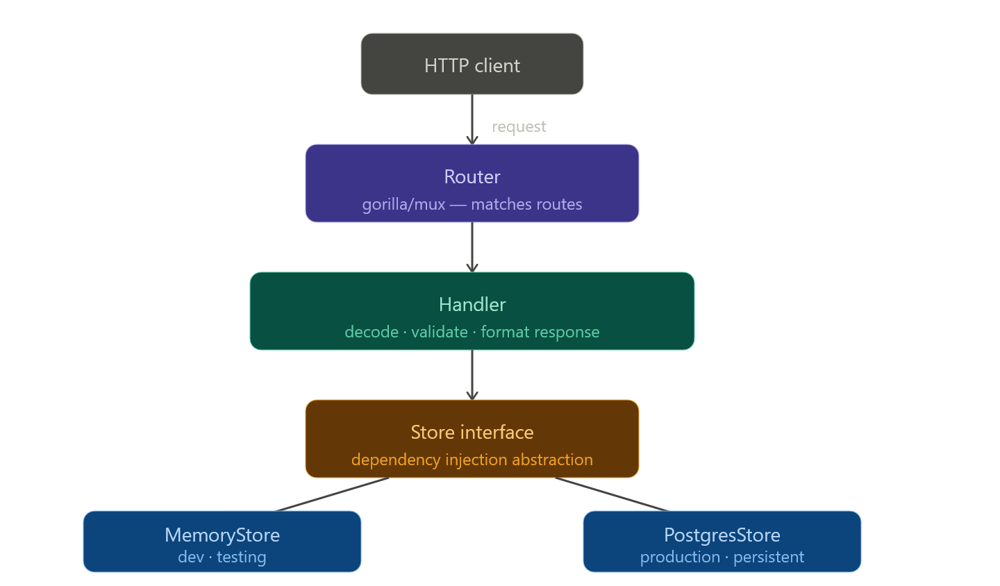

# ARCHITECTURE.md

Gerald Wagner-Mistlberger s2510455007

## 1. Request Flow Overview

The API follows a modular, layered architecture where concerns are separated into models, handlers, and storage providers. Below is the flow of a typical HTTP request (e.g., `POST /products`).

### Flow Steps:

1. **Routing**: The `gorilla/mux` router parses the incoming request and matches it to a registered handler.
2. **Handling & Validation**: The handler decodes the request payload into a `model.Product` and runs the `Validate()` method to ensure data integrity (e.g., non-empty name, positive price).
3. **Data Persistence**: The handler interacts with the `Store` abstraction. It does not need to know if the data is going to a database or a local map.
4. **Response**: The result is serialized to JSON and returned with the appropriate HTTP status code.

------

## 2. Storage Implementations

The system is designed with **Dependency Injection**, allowing it to switch storage backends based on the environment configuration (`DB_HOST`).

### Comparison: MemoryStore vs. PostgresStore

| **Feature**     | **MemoryStore**                               | **PostgresStore**                             |
| --------------- | --------------------------------------------- | --------------------------------------------- |
| **Persistence** | **Volatile**: Data is lost on server restart. | **Persistent**: Data is saved to disk.        |
| **Concurrency** | Managed via `sync.RWMutex` in Go.             | Managed by PostgreSQL's ACID transactions.    |
| **Scaling**     | Vertical only (limited to one instance).      | Horizontal (multiple instances share one DB). |
| **Best For**    | Testing, CI/CD, Local Development.            | Production, Multi-user environments.          |

### When to use each?

- **Use `MemoryStore`** when you need a fast, zero-dependency environment for **Unit Testing** or rapid **Local Development**. It ensures tests are isolated and don't require a database setup.
- **Use `PostgresStore`** for **Production** or **Staging**. It is required when data needs to survive application crashes, or when running multiple instances of the API behind a load balancer.

### Key Trade-offs

| Factor          | **MemoryStore**                                              | **PostgresStore**                                            |
| --------------- | ------------------------------------------------------------ | ------------------------------------------------------------ |
| **Data Safety** | **High Risk**: A simple server restart or crash wipes all data. | **High Safety**: Uses WAL (Write-Ahead Logging) and disk storage to ensure data survives crashes. |
| **Scalability** | **Vertical Only**: State is locked to a single instance. You cannot "load balance" across multiple servers. | **Horizontal**: Multiple API instances can share the same database, allowing the system to handle much higher traffic. |
| **Complexity**  | **Zero Overhead**: No external dependencies or network configuration required. | **Operational Cost**: Requires managing connection pools, migrations, backups, and network latency. |

------

## 3. Project Structure

The codebase is organized for maintainability and separation of concerns:

- **`cmd/api/main.go`**: The entry point. It handles environment configuration, initializes the chosen `Store`, injects it into the `Handler`, and starts the HTTP server.
- **`internal/model/`**: Contains the core domain entities (e.g., `Product` struct) and business-level validation logic.
- **`internal/handler/`**: The "web" layer. It translates HTTP requests into internal function calls and formats internal results back into HTTP responses.
- **`internal/store/`**: The "data" layer. Contains the implementations for both in-memory and PostgreSQL persistence logic.

