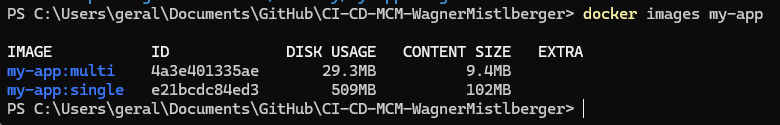
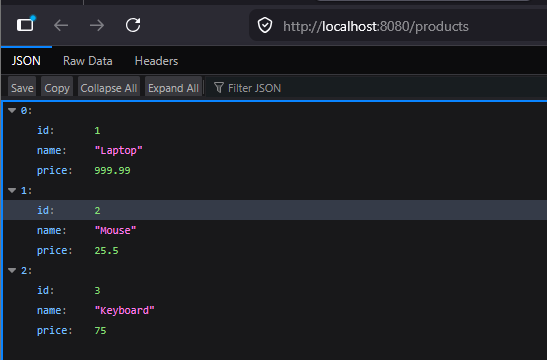
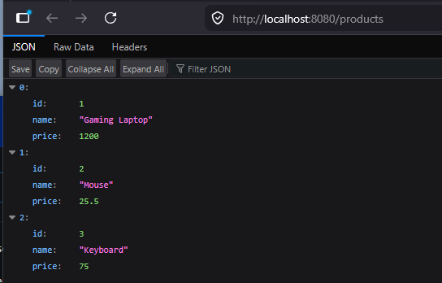
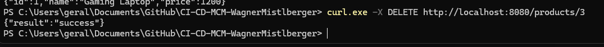
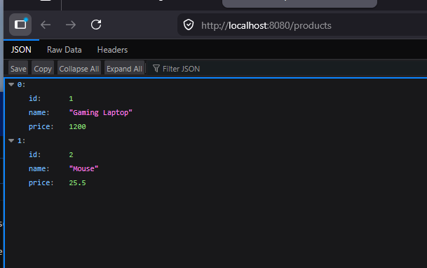

# DOCKER.md: Analysis of the Build Process

## Explanation of the Two Stages

The Dockerfile uses a "multi-stage build," which is like using two different rooms to finish a project: a workshop for building and a clean room for running.

#### Stage 1: The Builder Stage

In this first part, we set up a "workshop" that has all the tools needed to turn code into a program.

    We start with an image that includes the Go programming language tools.  
    
    We download all the external code pieces (dependencies) needed for the app.  
    
    We compile the code into a single executable file called api-server.  

#### Stage 2: The Runtime Stage

Once the program is built, we move it to a much smaller and simpler environment.

    We start with a very lightweight system called Alpine.  
    
    We copy only the finished api-server file from the first stage.  
    
    By doing this, we leave behind all the heavy building tools, making the final image much smaller and more secure.  
    
    Finally, we tell the system to listen for connections on port 8080.  

## What does CGO_ENABLED=0 do?

This setting is a specific instruction for the Go compiler used during the build command.  

    It tells the computer to build the app without using any external "C" language libraries.  
    
    Why it is important: It makes the program "self-sufficient." Because the final stage uses a very minimal version of Linux (Alpine), it does not have many of the standard libraries found on other systems. By setting CGO_ENABLED=0, we ensure the app has everything it needs inside itself so it can run on Alpine without crashing.

## Image Size Comparison

Based on the build tests performed, there is a massive difference in efficiency between the two methods:

| Build Type                         | Total Disk Usage |
| ---------------------------------- | ---------------- |
| **Single-Stage** (`my-app:single`) | **509 MB**       |
| **Multi-Stage** (`my-app:multi`)   | **29.3 MB**      |



# CRUD and Persistence Testing

## 1. CRUD Operations Testing

I used `curl` commands to test the Basic "CRUD" (Create, Read, Update, Delete) functions of the API.

#### Step 1: Create 3 Products

I sent three separate requests to the server to add items to the database.

```bash
curl.exe --% -X POST http://localhost:8080/products -H "Content-Type: application/json" -d "{\"name\":\"Laptop\",\"price\":999.99}"
curl.exe --% -X POST http://localhost:8080/products -H "Content-Type: application/json" -d "{\"name\":\"Mouse\",\"price\":25.50}"
curl.exe --% -X POST http://localhost:8080/products -H "Content-Type: application/json" -d "{\"name\":\"Keyboard\",\"price\":75.00}"
```

#### Step 2: List All Products

I verified the products were saved by requesting the full list.

```bash
curl http://localhost:8080/products
```



#### Step 3: Update a Product

I changed the price of the "Mouse" (assuming it was assigned ID 2)

```bash
curl -X PUT http://localhost:8080/products/2 -H "Content-Type: application/json" -d '{"name":"Gaming Laptop","price":1200}'
```



#### Step 4: Delete a Product

I removed the "Keyboard" (ID 3) from the database

```bash
curl -X DELETE http://localhost:8080/products/3
```



#### Step 5: Verify Deletion

I checked the list one last time to ensure ID 3 was gone

```bash
curl http://localhost:8080/products
```



---

## 2. Data Persistence Testing

This test confirms that our data is stored in a **Volume** (a permanent storage spot on your computer) rather than inside the temporary container memory.

### The Process:

1.  **Stop the App**: I ran `docker compose down`. This stops the containers and removes them entirely.
2.  **Restart the App**: I ran `docker compose up -d`. This creates brand new containers.
3.  **Check Data**: I ran `curl http://localhost:8080/products`

### The Result:

The products (Laptop and Gaming Mouse) **still existed**.

### Why did this work?

Even though the containers were deleted and recreated, the database was told to store its files in a **Docker Volume**. 


